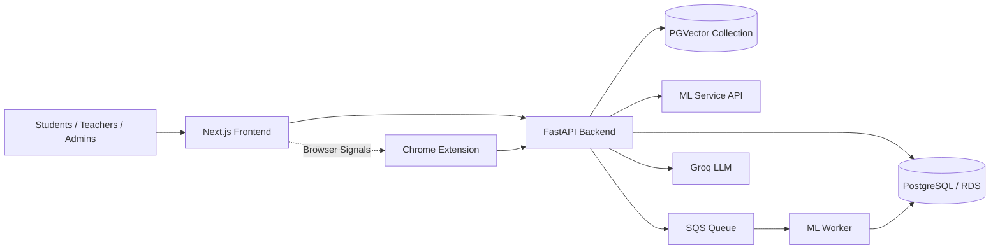
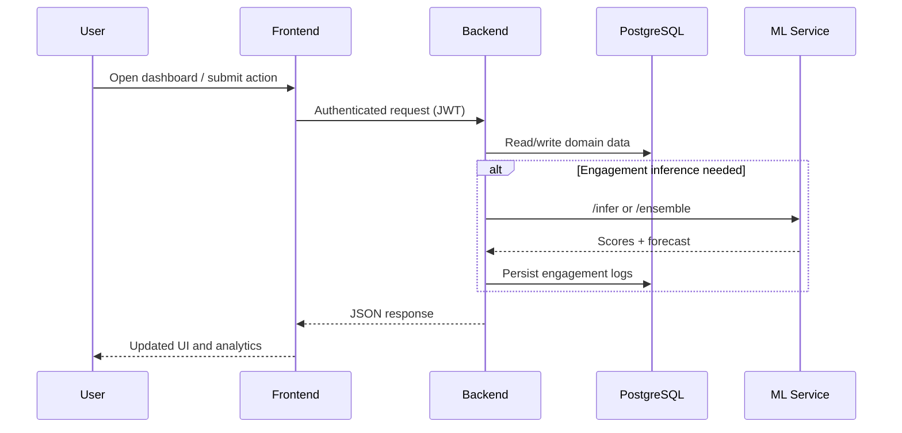
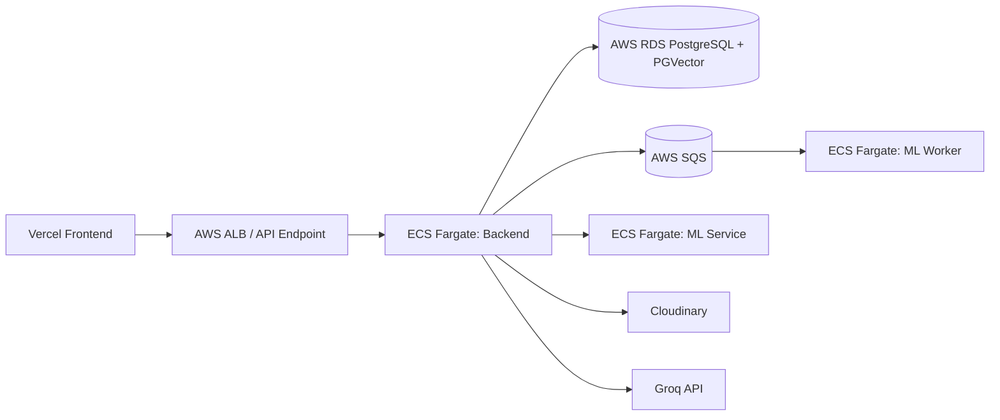
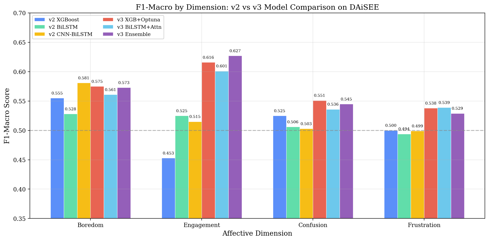
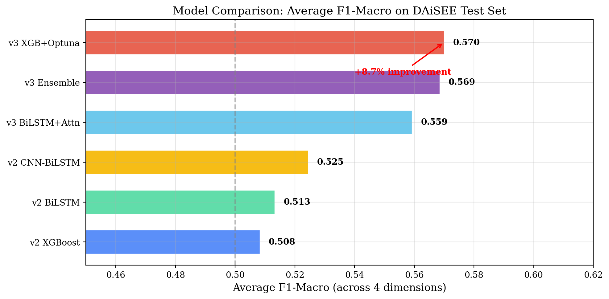
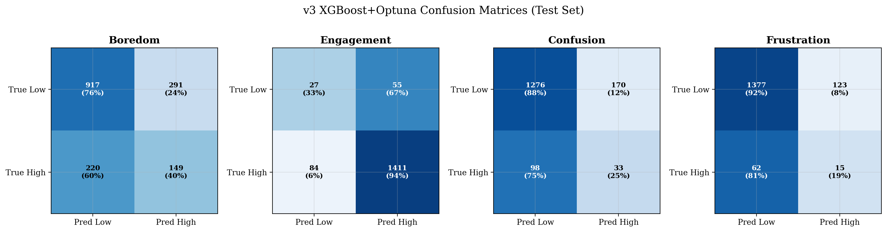

# SmartLMS v2

SmartLMS v2 is a full-stack, AI-native learning platform with:
- Next.js frontend for students, teachers, and admins
- FastAPI backend for business logic, analytics, and orchestration
- Dedicated ML microservice and worker for engagement inference
- Aika RAG tutor powered by Groq + PGVector

## Visual Overview

### Platform Architecture



### Runtime Request Flow



### Aika RAG Pipeline

```mermaid
flowchart TD
   A[Upload Material<br/>PDF/MD/TXT] --> B[/api/aika/upload-material/]
   B --> C[Loader: PyPDFLoader / TextLoader]
   C --> D[Chunking: RecursiveCharacterTextSplitter]
   D --> E[Embedding: all-MiniLM-L6-v2]
   E --> F[(PGVector aika_knowledge)]

   Q[User Question] --> H[/api/aika/chat/]
   H --> I[Aika ask()]
   I --> J[Retriever Tool<br/>search_course_materials]
   J --> F
   I --> K[Groq Chat Model]
   K --> L[Answer with citations]
```

### AWS Deployment Topology



## Project Images

### Model and Analytics Figures







## Monorepo Structure

- smartlms-frontend: Next.js 16 + React 19 + TypeScript UI
- smartlms-backend: FastAPI app, routers, auth, analytics, integrations
- smartlms-ml-service: ML inference API + worker loop
- smartlms-extension: Browser extension for watch/activity signals
- research_and_training: training and experimentation assets
- docker-compose.yml: local orchestration

## Core Features

### Frontend
- Auth and role-based routing
- Student dashboard, analytics, AI tutor, quizzes, assignments, leaderboard
- Teacher course/lecture management, grading, engagement analytics
- Admin system analytics, user management, teacher insights

### Backend
- Routers: auth, courses, lectures, engagement, quizzes, feedback, notifications, analytics, admin, users, gamification, assignments, activity, tutor, messaging, aika
- JWT auth and role checks
- Rate limiting middleware
- Async SQLAlchemy persistence layer

### ML and AI
- Ensemble-oriented inference engine
- Export model registry + lazy model loading
- Forecast and ICAP-oriented analytics support
- Aika RAG with ingestion and retrieval from PGVector

## API Overview

Base URL: /api

### Authentication
- POST /api/auth/register
- POST /api/auth/login
- POST /api/auth/google
- GET /api/auth/me
- PUT /api/auth/me
- POST /api/auth/change-password

### Courses and Lectures
- GET /api/courses
- GET /api/courses/enrolled/my-courses
- POST /api/courses
- POST /api/courses/{course_id}/enroll
- GET /api/lectures/course/{course_id}
- POST /api/lectures
- POST /api/lectures/youtube-import
- POST /api/lectures/{lecture_id}/generate-transcript
- POST /api/lectures/materials/upload

### Engagement and Analytics
- POST /api/engagement/submit
- GET /api/engagement/job/{log_id}
- POST /api/engagement/finalize-session
- GET /api/analytics/student-dashboard
- GET /api/analytics/student-engagement-history
- GET /api/analytics/student/icap-distribution
- GET /api/analytics/lecture-waves/{lecture_id}
- GET /api/analytics/course-dashboard/{course_id}

### Quizzes and Assignments
- POST /api/quizzes
- POST /api/quizzes/attempt
- POST /api/quizzes/generate-ai
- GET /api/quizzes/course/{course_id}/analytics
- POST /api/assignments
- POST /api/assignments/submit
- PUT /api/assignments/submissions/{submission_id}/grade
- POST /api/assignments/generate-ai

### Tutor, Messaging, Notifications
- GET /api/tutor/sessions
- POST /api/tutor/sessions
- POST /api/tutor/chat (streaming)
- GET /api/messages/conversations
- POST /api/messages
- GET /api/notifications
- PUT /api/notifications/read-all

### Admin
- GET /api/admin/system-stats
- GET /api/admin/teachers
- GET /api/admin/users
- GET /api/admin/engagement-correlation
- GET /api/admin/export-datasets

### Aika RAG
- POST /api/aika/chat
- POST /api/aika/upload-material

## Aika RAG Steps (Detailed)

1. Upload document to /api/aika/upload-material.
2. Backend writes temporary file and selects loader by extension.
3. Document is split into chunks and embedded.
4. Chunks are stored in PGVector collection aika_knowledge.
5. User asks question via /api/aika/chat.
6. Aika ask() triggers retriever tool search_course_materials.
7. Groq model composes response using retrieved context.
8. Response is returned to frontend.

## Local Development

### Prerequisites
- Node.js 20+
- Python 3.10+
- Docker Desktop

### Start Backend + ML Services

```bash
docker compose up --build
```

Services:
- Backend: http://localhost:8000
- ML service: http://localhost:8001

### Start Frontend

```bash
cd smartlms-frontend
npm install
npm run dev
```

Frontend: http://localhost:3000

## Environment Variables

### Frontend
- NEXT_PUBLIC_API_URL

### Backend
- DATABASE_URL / DATABASE_URL_SYNC
- GROQ_API_KEY
- JWT_SECRET_KEY
- RATE_LIMIT_ENABLED and related settings
- ML_SERVICE_URL
- Cloudinary credentials

### ML Service / Worker
- DATABASE_URL
- SQS_QUEUE_URL
- AWS_ACCESS_KEY_ID
- AWS_SECRET_ACCESS_KEY
- AWS_REGION

## Security and Reliability

- JWT auth + role authorization
- Request rate limiting
- CORS protections
- Global exception and validation handlers
- Health checks:
  - Backend: /api/health and /api/health/checkpoint
  - ML service: /health

## Useful Files

- docker-compose.yml
- smartlms-backend/app/main.py
- smartlms-backend/app/routers
- smartlms-backend/app/services/aika_service.py
- smartlms-frontend/src/lib/api.ts
- smartlms-ml-service/app/main.py
- aws_production_verification.md
- production_secrets_guide.md
